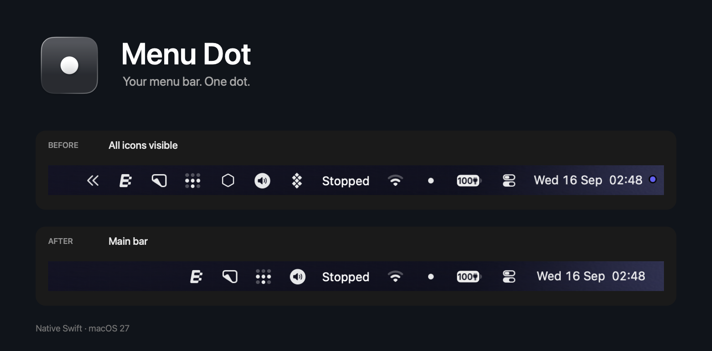

# Menu Dot



A small native Swift menu bar manager for macOS 27. Assign icons to Main, Secondary, Both, or Always hidden. No Dock icon, external packages, or background helper. This is a source-only project: build and sign your own copy.

> [!WARNING]
> This application was built entirely with gpt-6-astra. Use it at your own risk.

## Use

- Click the dot to switch between Main and Secondary while started.
- Right-click the dot for Settings and Start or Stop. Stop restores all icons.
- Sleep and inactive sessions temporarily restore icons. Switching resumes on return if it was started, preserving the selected bar.
- Hold Command and drag menu bar icons to rearrange them using native macOS behavior.
- In Settings, choose the default group for new icons, launch at login, and whether to launch Started or Stopped.
- Click the trash button beside an icon in Settings to remove its saved entry and group. If the icon is detected again, it returns using the default group for new icons.
- Icon detection offers Regular polling every 5 seconds or Battery Saver every 30 seconds. App launch/exit events and manual refresh still update immediately. No polling runs while stopped with settings closed.

Enable Accessibility when prompted to detect menu bar icons. Icons belonging to the same app move together. Clock and Control Center cannot be hidden.

## Build and sign

Requires macOS 27, Xcode 27, Python 3, and OpenSSL available in your shell. Open Xcode once to finish its setup, then run from the cloned repository:

```sh
export DEVELOPER_DIR=/Applications/Xcode.app/Contents/Developer
./scripts/run.sh
```

This builds, signs, installs into `/Applications/Menu Dot.app`, and launches it. Use `./scripts/build.sh` to build and sign without installing. Run the installed copy: launching from the project folder can cause macOS to hide the app's own dot.

Signing is automatic. The first build creates your own self-signed development certificate in a private keychain under `~/Library/Application Support/MenuDot/Signing`. Later builds reuse it so Accessibility approval can survive updates. Keep that directory private and intact. No paid Apple Developer account or notarization is needed for this local build. The scripts do not change system certificate trust or your default keychain.

The build uses `dev.<username>.menudot` as its app identifier, based on your macOS username.

## macOS limitation

Menu Dot uses an undocumented macOS 27 API. It may change between OS releases, and some Apple controls may disappear while switching is active. Stop or quit Menu Dot to restore them.

## Why can't I just download the binary?

Because I'm not paying Apple $100 a year for this shit. That's what Developer ID signing and notarization would cost, even for a free app. I could ship an unnotarized binary, but you'd still have to deal with macOS security warnings.

Once the build tools above are installed, run `./scripts/run.sh` and you have the app ready. You also get all the source code, so you can see what it does and change whatever you want.
